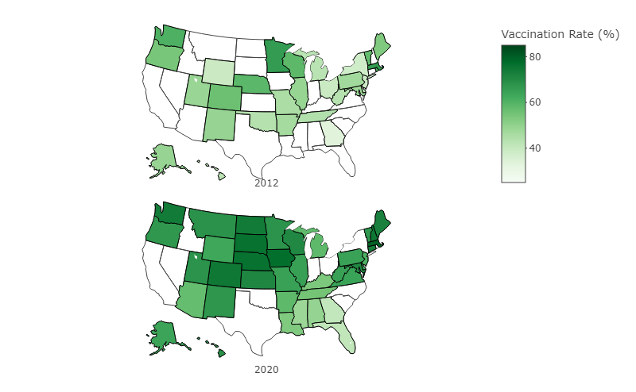

\captionsetup[table]{labelformat=empty}

```{r setup, include=FALSE} 
knitr::opts_chunk$set(
  warning = FALSE,
  message = FALSE,
  eval=TRUE,
  echo = TRUE,
  cache = FALSE,
  out.width = "100%", 
  fig.align = 'center',
  class.source = "code-r",
options(repos = c(CRAN = "http://cran.rstudio.com")))
```

```{r, Load required libraries, include=FALSE}
library(data.table)
library(dplyr)
library(tidyverse)
library(dtplyr)
library(knitr)
library(ggplot2)
library(readr)
library(plotly)
library(DT)
```

```{r load-data, warning=FALSE, message=FALSE, include=FALSE}
if (!file.exists("https://raw.githubusercontent.com/CBSC73/PM566-Final_Project/main/Vaccination_Coverage_dataset.txt")) {
  download.file("https://raw.githubusercontent.com/CBSC73/PM566-Final_Project/main/Vaccination_Coverage_dataset.txt", 
                "Vaccination_Coverage_dataset.txt", method="libcurl", timeout = 60)  
}

vax <- data.table::fread("Vaccination_Coverage_dataset.txt", data.table=getOption("datatable.fread.datatable", TRUE)) 
```

```{r, look at variables, include=FALSE}
#Rename columns
vaxdf<-as.data.frame(vax)
vaxdf <- rename(vaxdf, Year="Survey Year/Influenza Season", Percent_Vax="Estimate (%)",Age_Ethn="Dimension Type", Geog_Type="Geography Type")

#Remove duplicates
vaxdf<-unique(vaxdf)
dim(vaxdf)

#Remove Tdap data,Puerto Rico, City of NY/Rest of NY, D.C.
vaxdf<-vaxdf%>%filter(Vaccine=="Influenza", Geography!="District of Columbia", Geography!="NY-City of New York", Geography!="NY-Rest of state", Geography!="Puerto Rico")
dim(vaxdf)

#Make variables numeric to better evaluate them
head(vaxdf)
vaxdf$Percent_Vax<-as.numeric(as.character(vaxdf$Percent_Vax))
vaxdf$Year<-as.numeric(as.character(vaxdf$Year))


#Look for missing values
dim(vaxdf)
colSums(is.na(vaxdf)) #There are 267 missing values out of 2470 (10.8%)

#Where are the missing values? Will check by variables of interest: Age, Race/Ethnicity, location (U.S., states)
vaxdfage<-vaxdf %>% filter(Age_Ethn=="Age")
vaxdfeth<-vaxdf %>% filter(Age_Ethn=="Race/Ethnicity")
vaxdfUS<-vaxdf %>% filter(Geog_Type=="National")
vaxdfSTATES<-vaxdf %>% filter(Geog_Type=="States")

#Age
colSums(is.na(vaxdfage)) #12 missing values out of 1244 (1%)
dim(vaxdfage)

#Ethnicity
colSums(is.na(vaxdfeth)) #255 missing values out of 1226 (20.1%)
dim(vaxdfeth)

#National
colSums(is.na(vaxdfUS)) #No missing values
dim(vaxdfUS)

#States
colSums(is.na(vaxdfSTATES)) #267 missing values out of 2398 (11.1%)
dim(vaxdfSTATES)

#We can see that the vast majority of missing values are Race/Ethnicity data points in the state specific data. I only plan to examine race/ethnicity on a national level however so will not try to impute NA valu1es.

```

```{r, create 2012 and 2020 datasets, include=FALSE}

#Create datasets 
vaxtrim2012<-vaxdfSTATES %>% filter(Year=="2012", Dimension=="≥18 Years")

vaxtrim2020<-vaxdfSTATES %>% filter(Year=="2020", Dimension=="≥18 Years")

#Check each dataset for NA values
colSums(is.na(vaxtrim2012))
colSums(is.na(vaxtrim2020))
#There are no missing values for Age over 18 years data in the selected years

#Remove duplicates again just in case
vaxtrim2012<-distinct(vaxtrim2012)
vaxtrim2020<-distinct(vaxtrim2020)

view(vaxtrim2012)#Only 29 states included
view(vaxtrim2020)#Only 39 states included

```
## __Introduction__

##### Background: Influenza virus infection represents a significant disease burden on pregnant women and infants in the United States (1). Pregnancy and infancy (under 1 year of age) are times of relative immunosuppression and vulnerability to certain types of infection (2). Influenza virus has long been recognized as particularly virulent in pregnant women (3, 4) with an increased risk for hospitalization, ICU admission, and death (5). During the 2009 H1N1 Influenza pandemic, pregnant women had a five times higher risk of death from influenza virus infection and associated serious morbidities (such as Staphylococcus aureus pneumonia superinfection and acute respiratory distress syndrome) than the general population (6-8). 

##### Immunization during pregnancy creates IgG antibodies that cross the placenta and enter fetal circulation where they remain for approximately six months (9, 10). Breastfeeding also transmits maternal antibodies that protect newborns from infections (9). Antibodies acquired in the pre- and peri-natal periods protect babies after birth until at least 6 months of age (11). This is critical because infants are not eligible for influenza vaccination until 6 months old (12). Indeed, infants under 6 months have the highest rates of hospitalization related to the infection of any age group, including older adults. Rates are estimated at 4.5 hospitalizations per 1000 children (13), which given approximately 4 million babies born each year in the U.S., translates to nearly 18,000 hospitalizations. In addition to the human costs of caring for a sick infant, this represents a multi-billion-dollar burden on the medical system, especially as these infections are compressed into the December-March timeframe (“Flu season”) (47). 

##### Prenatal exposure to maternal influenza infection is known to have a negative impact on long term childhood outcomes.  Indeed, vaccination against influenza during pregnancy is associated with a reduced risk of preterm birth, small for gestation age status (indicating poor fetal growth), and low birth weight (less than 2500g or 5.5 pounds) at delivery (14-16). The strong associations between the above morbidities, especially prematurity, with worse long term neurodevelopmental outcomes, is well established (17-21).  In addition to the above, several studies have found an association between Influenza infection during pregnancy (22-24), especially during the first trimester, and later development of autism spectrum disorders in offspring. Indeed, children conceived in the winter months (December-March, peak influenza season) have a 6% increased risk of autism spectrum disorder. Similarly, schizophrenia, a devastating neuropsychological disorder that most often presents in early adulthood has been linked to first trimester prenatal influenza infection exposure with a 7-fold increased risk (25). Bipolar disorder has also been associated with prenatal Influenza infection exposure with a nearly 4-fold increased risk (26).

##### The yearly influenza vaccine has a long track record of safety and efficacy during pregnancy and is recommended by the Centers for Disease Control (CDC) and the American College of Obstetrics and Gynecology (ACOG) for all pregnant women (27, 28). The World Health Organization (WHO) recommends a minimum 75% vaccination rate among the population to protect those at highest risk for severe infection (29). In fact, the WHO considers pregnant women to be the highest priority influenza vaccination group for countries initiating or extending vaccine efforts (29). It is well documented that the influenza vaccine during pregnancy is effective, reducing proven infections in infants 0-6 months of age by up to 63% and in pregnant women by over 50% (11, 14). Despite its efficacy, and the strong recommendations by the CDC and ACOG organizations,many pregnant U.S. women remain unvaccinated. This report examines influenza vaccine rates among the pregnant population in the U.S. and looks at trends over time using qualitative analyses of publicly available data.

##### Research Questions: The objective of this report is two-fold: 1.To determine whether the influenza vaccination rate for pregnant women is increasing or decreasing in the U.S., and 2. Examine factors associated with low and high vaccine uptake, looking at trends over time. 
##### Identifying those pregnant women less likely to be vaccinated can help inform where efforts to promote vaccine utilization are needed most. Conversely, identifying where vaccination rates have recently improved may provide clues about where to look for examples of successful pro-vaccination public health campaigns.

<br>

## __Methods__


##### __Study Population__: This data was acquired from the Centers for Disease Control website [view here](https://data.cdc.gov/browse?category=Pregnancy+%26+Vaccination). The study population was pregnant women 18-49 years of age, residing in the United States, who were pregnant anytime between August 1st and the survey date. Surveys were an internet panel national survey conducted at the end of Influenza Season (March-April).  Sample sizes were between 32,000-47,000 per year.


##### __Data Cleaning and Wrangling__: Data was downloaded directly from the CDC website as a text file with comma separated variable datapoints. The years 2012-2020 were covered and vaccination rates for influenza as well as Tdap were included. As my interest is influenza vaccination, Tdap data was removed. New York City, Puerto Rico and the District of Columbia were also in the dataset, however I removed these as my interest is in the 50 U.S. states. The dataset did not report data on all 50 states for all years. In 2012, only 29/50 states had data. In 2020, 39/50 states had included data. Age group and race/ethnicity data were included in the dataset, with both national and by state information. The age and race/ethnicity data were reported separately (not within subgroup with respect to the other variable) and thus were not able to be examined simultaneously (i.e. examining age group trends by race/ethnicity).

##### Missingness was examined as a whole and by variable. Overall, there were found to be 267 missing observations out of 2,470 (10.8%). Breaking this down by variable, I found that within the age group data, only 12 out of 1,244 observations were missing. As this only represented 1% of data points, these were removed.  Within the race/ethnicity data, 255 out of 1,226 observations were found to be missing (20.1%). Separating out the missing values by national versus state data, it was found that all missing values were from state specific race/ethnicity data. Given the 20% missingness rate for this subset of the data, and likely introduction of inaccuracies with attempted imputation given variability in state participation in the survey each year, I decided to only examine race/ethnicity on a national level. A region variable was created using states by region specified on the CDC website (states were divided into West, Midwest, Northeast and South). Duplicate rows were examined for and removed. Summary statistics were performed to check for implausible values and none were identified.

##### __Software__: Data analysis was performed using “R”, an open source data analysis tool (R Core Team (2018). R: A language and environment for statistical computing. R Foundation for Statistical Computing, Vienna, Austria [URL here](https://www.R-project.org/).The following R libraries were used for data wrangling, analyses, graphs, and tables: Data.Table, dplyr, tidyverse, knitr, ggplot2, readr, plotly, DT. The code behind this website and accompanying PDF is published in full on my github repository [website source code](https://github.com/CBSC73/PM566-Final_Project/blob/main/index.Rmd) and [PDF source code](https://github.com/CBSC73/PM566-Final_Project/blob/main/report.Rmd).

<br>

## __Results__

##### National – The influenza vaccination rate among pregnant women in the U.S. is increasing. Despite not all states reporting for each year, a national overview between 2012 and 2020 (Figure 1) shows a clear increase over time. In 2012 the national vaccination rate for all women over the age of 18 was 47.4% (N=31, 507), and by 2020 it had increased to 61.1% (N=40, 339). This represents an increase nationally of 13.7%.


```{r, chloropleth set up, include=FALSE}

library(dplyr)

#Rename the Geography column "state" so it will merge 
vaxtrim2012 <- rename(vaxtrim2012, state="Geography")
vaxtrim2020 <- rename(vaxtrim2020, state="Geography")

#Get state info into dataset, merge
st_crosswalk <- tibble(state = state.name) %>%
   bind_cols(tibble(abb = state.abb))

vaxtrim2012 <- left_join(vaxtrim2012, st_crosswalk, by = "state")
vaxtrim2020 <- left_join(vaxtrim2020, st_crosswalk, by = "state")

```

##### Figure 1. Influenza Vaccination Rate During Pregnancy by State in 2012 vs 2020


```{r, out.width="70%", fig.align="center", echo=FALSE}

```

##### Region - Next, Influenza vaccination rates were evaluated by region, comparing the year 2012 to the year 2020 (Figure 2). The Midwest region had the largest increase in median vaccination rate, starting at 49.1% in 2012 up to 70.95% in 2020, a nearly 22% increase. Conversely, the South had the lowest rate increase, from 43.6% in 2012 to 54.3% in 2020, a 10% change. All four U.S. regions had increased vaccine rates over time, with the Northeast having the highest rates (72.4% in 2020) and the South having the lowest (54.3% in 2020). In 2012 the vaccination rate in the Midwest region was below the Northeast and West, however in 2020 it overtook the Western region with rates close to the Northeast by 2020 (Midwest vaccine rate in 2020, 70.95%). 

```{r, examine by region, first create region variable, include=FALSE}
vaxdfSTATES <- rename(vaxdfSTATES, state="Geography")

vaxdtSTATES<-as.data.table(vaxdfSTATES)

vaxdtSTATES <-vaxdtSTATES[, region := fifelse(state== "Alaska"| state=="Arizona" | state=="California" | state=="Colorado"| state=="Hawaii"| state=="Idaho"| state=="Montana"| state=="Nevada"| state=="New Mexico"| state=="Oregon"| state=="Utah"| state=="Washington"| state== "Wyoming", "WEST",
                fifelse(state=="Alabama"|state=="Arkansas"|state== "Delaware" | state=="Florida"|state== "Georgia" | state=="Kentucky" |state== "Louisiana"|state== "Maryland" | state=="Mississippi" |state=="North Carolina"|state=="Oklahoma"| state=="South Carolina"| state=="Tennessee" |state=="Texas"|state== "Virginia"|state== "West Virginia", "SOUTH",
                fifelse(state=="Illinois"| state=="Indiana"| state=="Iowa"|state== "Kansas"| state=="Michigan"|state== "Minnesota"| state=="Missouri"| state=="Nebraska"| state=="North Dakota"| state=="Ohio"|state=="South Dakota"|state=="Wisconsin", "MIDWEST",                        "NORTHEAST")))]
```


##### Figure 2. Influenza Vaccination Rate Among Pregnant Women in the U.S. 2012 vs 2020

```{r, compare vaccine rates by region over time, echo=FALSE, fig.width = 8, fig.asp=0.5, fig.align = "center", out.width="70%"}
vaxdfSTATES<-as.data.frame(vaxdtSTATES)

vaxdfSTATES_regGraph<-vaxdfSTATES%>%filter(Dimension=="≥18 Years", Year==2012| Year==2020)

p<-ggplot(vaxdfSTATES_regGraph,aes(y=Percent_Vax, x=region, fill = region) 
) +   
  geom_boxplot(color="black")+
  labs(y= "Vaccination Rate (%)", x="Region", fill="Region")+
    theme(axis.text.x=element_blank(),legend.background = element_rect(color = "black")
                                        )+
scale_fill_brewer(palette = "Set1")+
  facet_wrap(~Year, nrow=1)

p

```

##### States – Data was next examined at the individual state level. A line graph (Figure 3) shows each state by year. There is a general upward trend between 2012 and 2020. The two states at the bottom of the graph with the lowest vaccination rates are Georgia and Florida. Massachusetts and Iowa top the list of highest vaccinated states with 79.8% and 77.1% in 2020 respectively. Change in vaccination rate between 2012 and 2020 is examined in Table 1 by state (top 10 states with the largest change in vaccination rate pictured. For the full dataset examining states with interactive features, please see Figure 3 and Table 1 of the [website](https://cbsc73.github.io/PM566-Final_Project/). The states of Hawaii, Wyoming, Maryland, and New Jersey had the largest increases with 26.7, 24.2, 22.6, and 22.2 percent respectively. The top ten states are shown in Table 1 below.

##### Figure 3. Influenza Vaccination Among U.S Women by State, 2012-2020

```{r, echo=FALSE, fig.width = 8, fig.asp=0.4, fig.align = "center"}


gall<-vaxdfSTATES%>% filter(Dimension=="≥18 Years") %>% arrange(Year) %>% 
ggplot(aes(x = Year, y = Percent_Vax, color = state
        )) +
  geom_line()+
  labs(y= "Vaccination Rate (%)")

gall
```


```{r, table create, echo=FALSE, fig.width = 10, fig.asp=0.4, fig.align = "center", tab.cap = NULL}
vaxchange<-vaxdfSTATES %>% 
  filter(Year=="2012"|Year=="2020", Dimension=="≥18 Years") %>% 
  select(state, Year, Percent_Vax) %>% 
  pivot_wider(names_from=Year, values_from=Percent_Vax)

vaxchange$Change = (vaxchange$"2020" - vaxchange$"2012")
vaxchange<- vaxchange %>% arrange(desc(Change)) 

vaxchange<-vaxchange[1:10,]

colnames(vaxchange)<- c("State", "2012(%)", "2020(%)", "Change(%)")
knitr::kable(vaxchange, align=c("l", "c", "c", "c"), caption = "Figure 1. States with Largest Increase in Vaccination Rate, 2012 to 2020")

```

##### Age – Data was available for each of three age groups: 18-24 years, 24-34 years, and 35 years old and above. Nationally, women 35 years and older have the highest vaccination rates and those aged 18-24 years have the lowest (Figure 4, Table 2). In terms of change over time, pregnant women 35 years and older had the largest increase, 15.2% (from 51.8% in 2012 to 67% in 2020). For women ages 24-34 years, vaccination rate has been relatively constant between 2016-2020, hovering in the low 60s percent range. This is also true for the youngest age group, women 18-24 years of age who have had vaccination rates in the low 50s since 2016. State specific data broken down by age group is in Table 3. 


```{r,  data prep, include=FALSE}

vaxdtUS<-as.data.table(vaxdfUS)

#Rename terms in the Dimension variable so they're easier to work with 
vaxdtUS<-vaxdtUS[, Dimension1 := fifelse(Dimension=="≥35 Years", "35+ Years", 
                                             fifelse(Dimension=="18-24 Years", "18-24 Years", 
                                             fifelse(Dimension=="25-34 Years", "25-34 Years", 
                                             fifelse(Dimension=="≥18 Years", "18+ Years", 
                                             fifelse(Dimension=="Black, Non-Hispanic", "Black", 
                                             fifelse(Dimension=="White, Non-Hispanic", "White", 
                                             fifelse(Dimension=="Hispanic", "Hispanic", "Other")))))))]


#Make into a dataframe for graphs
vaxdfUS<-as.data.frame(vaxdtUS)

vaxdtSTATES<-vaxdtSTATES[, Dimension1 := fifelse(Dimension=="≥35 Years", "35+ Years", 
                                             fifelse(Dimension=="18-24 Years", "18-24 Years", 
                                             fifelse(Dimension=="25-34 Years", "25-34 Years", 
                                             fifelse(Dimension=="≥18 Years", "18+ Years", 
                                             fifelse(Dimension=="Black, Non-Hispanic", "Black", 
                                             fifelse(Dimension=="White, Non-Hispanic", "White", 
                                             fifelse(Dimension=="Hispanic", "Hispanic", "Other")))))))]

vaxdfSTATES<-as.data.frame(vaxdtSTATES)
```

##### Figure 4. Influenza Vaccination Among U.S Women by Age Group, 2012-2020

```{r, echo=FALSE, fig.width = 8, fig.asp=0.50, out.width="80%"}
#GGplot Version, AGE


vaxdfUS_ageGraph <-vaxdfUS%>%
   filter(Age_Ethn=="Age", Dimension1 !="18+ Years")


cbPalette<-c( "#3399FF", "#FF9900","#009E73","#cc0099")

#agebar<-

ggplot(vaxdfUS_ageGraph, aes(x=Year, y= Percent_Vax, fill = Dimension1))+
  geom_col(position="dodge", color="black")+ 
      labs(y="Vaccination Rate (%)", x="Year", fill="Age Group")+
        scale_fill_manual(values=cbPalette)+
        theme(legend.background = element_rect(size=0.5, color=1))
    

```


##### Ethnicity – Data was available for each of four race/ethnicity groups: “Black, non-Hispanic”, “Hispanic”, “White, non-Hispanic”, and “Other or multiple races, Non-Hispanic.” Data trends between 2012 and 2020 are demonstrated in Figure 5. Women in the "Other or multiple races, non-Hispanic" group had the largest increase in vaccination rate between 2012 and 2020, with a 21.3% increase (from 48.7% to 70%). This group overtook White, non-Hispanic women in 2014 and has had the highest influenza vaccination rate since that time. White, non-Hispanic women have also increased their rates by 16%, from 49.5% in 2012 to 65.5% in 2020. Black, non-Hispanic women have the lowest vaccination rate in all years examined. After an initial 14% increase in vaccination from 2012 to 2016 (36.1 to 50.4%), rates are decreasing among this group with a 2020 rate of 41.6%. Hispanic women are the next lowest group and have seen minimal change in yearly rate since 2015, hovering near 60%. Table 2 and Table 3 examine race/ethnicity data nationally (Table 2) and by state (Table 3).

##### Figure 5. Influenza Vaccination Among U.S Women by Race/Ethnic Group, 2012-2020

```{r, echo=FALSE, fig.width = 8, fig.asp=0.5, out.width="80%"}
#ggplot ethnicity

ethbar<-vaxdfUS%>%
   filter(Age_Ethn=="Race/Ethnicity") %>%  
   ggplot(aes(x= Year, y= Percent_Vax, fill=Dimension1))+
  geom_col(position="dodge", color="black")+ 
      labs(y="Vaccination Rate (%)", x="Year", fill="Race/Ethnicity")+
        scale_fill_manual(values=cbPalette)+
        theme(legend.background = element_rect(size=0.5, color=1))

ethbar
```

<br>

```{r, table2A, echo=FALSE, fig.align='center', fig.width = 10, fig.asp=0.4}
library(xtable)

table2A<-vaxdfUS %>% select(Year, Dimension1, Percent_Vax) 
table2A<-table2A %>% arrange(desc(Percent_Vax)) 
table2A<-table2A[1:5,]
colnames(table2A)<- c("Year", "Age/Race", "Rate (%)")

table2B<-vaxdfUS %>% select(Year, Dimension1, Percent_Vax)
table2B<-table2B %>% arrange(Percent_Vax)
table2B<-table2B[1:5,]
colnames(table2B)<- c("Year", "Age/Race", "Rate (%)")


knitr::kable(table2A, align=c("c", "l", "c"), caption = "Table 2A. Nationwide: Top 5 MOST Vaccinated Groups/Years Among Pregnant U.S. Women, 2012-2020")

knitr::kable(table2B, align=c("c", "l", "c"), caption = "Table 2B. Nationwide: Top 5 LEAST Vaccinated Groups/Years Among Pregnant U.S. Women, 2012-2020")

```


##### Table 2 shows the most (2A) and least (2B) vaccinated populations by all available variables on a national level. The top five most vaccinated demonstrate the trends we've seen thus far. They are in the latter years (2018-2020), in the "Other, non-Hispanic" ethnicity group, and are older women 35 years and above. The least vaccinated are in the "Black, non-Hispanic" and younger women (18-24 years) groups. We can see that the vaccination rate for Black women in the most recent year (2020) is one of the lowest, due to the downtrending vaccine uptake within this group since 2016.


```{r, table3A, echo=FALSE, fig.width = 10, fig.asp=0.4, fig.align = "center"}

table3A<-vaxdfSTATES %>% filter(!is.na(Percent_Vax)) %>% select(state,Year, Dimension1, Percent_Vax)
table3A<-table3A %>% arrange(desc(Percent_Vax)) 
table3A<-table3A[1:5,]
colnames(table3A)<- c("State", "Year", "Age/Race", "Rate (%)")


table3B<-vaxdfSTATES %>% filter(!is.na(Percent_Vax)) %>% select(state,Year, Dimension1, Percent_Vax)
table3B<-table3B %>% arrange(Percent_Vax)
table3B<-table3B[1:5,]
colnames(table3B)<- c("State", "Year", "Age/Race", "Rate (%)")

knitr::kable(table3A, align=c("l","c", "l", "c"), caption = "Table 3A. By State: Top 5 MOST Vaccinated Groups/Years Among Pregnant U.S. Women, 2012-2020")

knitr::kable(table3B, align=c("l","c", "l", "c"), caption = "Table 3B. By State: Top 5 LEAST Vaccinated Groups/Years Among Pregnant U.S. Women, 2012-2020")

```

##### Table 3 shows the most (3A) and least (3B) vaccinated populations by all available variables on a state level. The top five most vaccinated groups are from the Northeast, trend toward the later years, are older women (35 years and above), or in the "Other, non-Hispanic" ethnicity group. The top five least vaccinated are all from Georgia, the last vaccinated state in the country and trend toward "Black, non-Hispanic" and younger (18-24 years) groups.

##### For the remaining data in Tables 2 and 3 with interactive features, please see the [website](https://cbsc73.github.io/PM566-Final_Project/).

<br>

## __Discussion__

##### Influenza vaccination among pregnant women is overall increasing in the United States. All four U.S. regions have higher rates in 2020 than 2012. However, there are subgroups of the population that have been slow to improve, have not made progress for many years, and are even decreasing in vaccine uptake. These are groups that would benefit from focused public health interventions.

##### The Southern U.S. continues to have the lowest vaccination rate in the country. This gap has widened between 2012 and 2020, from 6 to 15 percentage points lower than the next lowest region. This is likely a multifactorial phenomenon, however two of the most influential demographic characteristics that predict vaccination status are insurance (private vs public) and level of education (30). This dataset did not address these factors directly. However, the South is the U.S. region with the lowest rates of college completion (28.2% in 2021, versus the Northeast with 34.8%) (31), and highest rates of public insurance recipients (32). Indeed, access to medical care is a known barrier to vaccination in the general adult population (33). One promising intervention is education of providers and public health interventions that target medical clinics which have been quite effective in improving vaccination rates (34-36).  Settings in which a provider can recommend and administer a vaccination at the same visit are particularly effective (34). These types of efforts, focused on the Southeast, especially Georgia and Florida have strong upward potential. These are large populous states where even a small improvement translates into many thousands of women and their children being protected.

##### As women get older, they are more likely to be vaccinated against influenza during pregnancy. Older women also had the largest increase in vaccination rate between 2012 and 2020 suggesting this demographic is a primary driver of increasing vaccination rates nationally. One potential basis for these trends is the average age of a first-time mother is increasing in the U.S. It was 21 years of age in 1972 and has risen to an average age of 30 as of 2022 (37). The percentage of total pregnancies that are to older mothers has also increased while those to the youngest has decreased (37). Interestingly, a strong predictor of maternal age at first pregnancy is level of education, specifically ascertainment of a college degree (38). Education level and maternal age are inextricably linked. Finishing a four-year degree leaves most people at age 22-23 years at time of completion and the costs of post-secondary education in the U.S are rising rapidly (39). Though not looked at directly in this dataset, education is a likely contributor to the linear relationship between age and vaccine uptake.  (For a closer look at these trends, a New York Times article featuring interactive maps on this subject, see [here](https://www.nytimes.com/interactive/2018/08/04/upshot/up-birth-age-gap.html). 

##### The race/ethnicity findings in this data demonstrate significant gaps in influenza vaccination between women who identify as Hispanic or Black, non-Hispanic versus White and “Other” ethnic categories. These disparities are likely reflective of socioeconomic inequality and reduced access to healthcare and educational opportunities in the U.S. (40-41). The COVID-19 pandemic shed a stark light on the how care is not equal between racial and ethnic groups (42). Troublingly, vaccination against influenza among pregnant women who identify as Hispanic, has not changed in many years, and for those who identify as Black, rates are even decreasing. These trends highlight the importance of community-specific public health outreach. 

<br>

### __Limitations__

##### There are some notable weaknesses of this dataset that limit available analyses. As noted in the methods, not all 50 states are included for each year of data. This reduces generalizability of national data as some states are more represented than others. Furthermore, due to lack of reporting of certain states, region data is less representative of the true vaccine rate. For instance, California is not reported in any year. Given that approximately 12% of the U.S. population lives in California, this is a significant limitation to accuracy. When examining by region, this problem is heightened as the state represents an even larger percentage of the population for the Western region. (The California Department of Public Health tracks influenza vaccination among pregnant women in the state using the Maternal and Infant Health Assessment, a statewide survey. For further information, visit their website [here](https://www.cdph.ca.gov/Programs/CFH/DMCAH/MIHA/Pages/Data-and-Reports.aspx?Name=AnnualReport) and their [PDF report](https://www.cdph.ca.gov/Programs/CID/DCDC/CDPH%20Document%20Library/Immunization/MIHA-FactSheet2016.pdf), (see page 4, figure 4 for influenza details). The second most populous state in the U.S., and most populous Southern region state, Texas, is also missing from this dataset for all years except 2015 and 2016. 

##### The reporting of age and race/ethnicity as separate vaccination rates is another limitation, as it prevents additional granularity within subgroups. For instance, it would have been illuminating to stratify data within age groups by race/ethnicity and vice versa to see in more detail the most and least vaccinated subpopulations. In addition, the race/ethnicity data by state had more than 20% of observations missing, limiting available examination of race/ethnicity trends by state and region. 

##### Lastly, these data were collected by internet panel survey thus introduce self-report and recall bias limitations.

<br>

## __Conclusions & Summary__

##### Influenza vaccination uptake among pregnant U.S. women is increasing, reaching over 60% in 2020. Despite this positive, trend, vaccination rates remain suboptimal, well below the WHO recommended 75%. By region, the South is the least (54.3%) and Northeast the most (72.4%) vaccinated areas of the country.  Women who are younger, and identify as Hispanic or Black, non-Hispanic are less likely to receive the influenza vaccine than women over the age of 35 who identify as either White or Other, non-Hispanic ethnic group. Reasons for these observations are multifactorial, and likely represent an interplay between levels of education, access to quality prenatal and preventative health care, and racial/ethnic socioeconomic disparities in the U.S (43-46). 

##### Overall, the above data indicate that efforts to increase influenza vaccine uptake in pregnant women will benefit most from community-based outreach targeting younger women who identify as Hispanic or Black, non-Hispanic in the Southern U.S.

<br>

### References can be found [here](https://github.com/CBSC73/PM566-Final_Project/blob/main/references.pdf)


